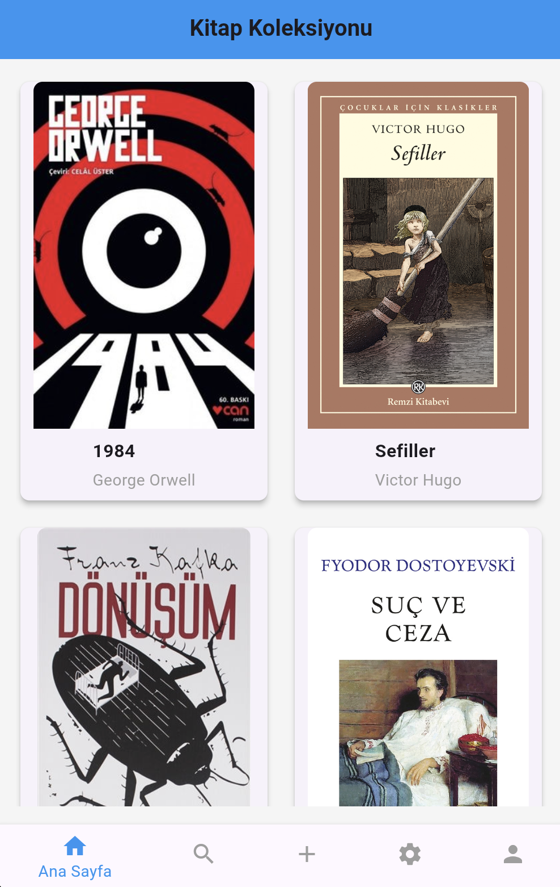
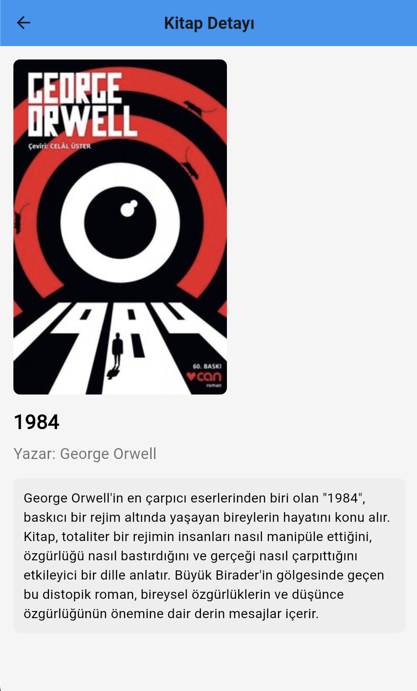
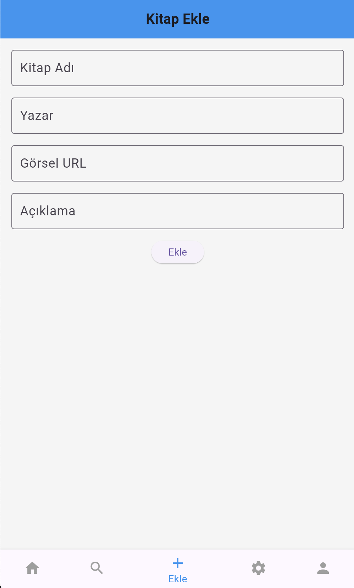
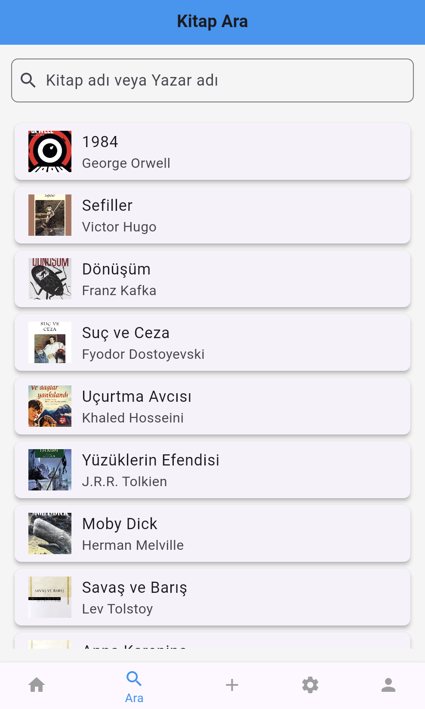
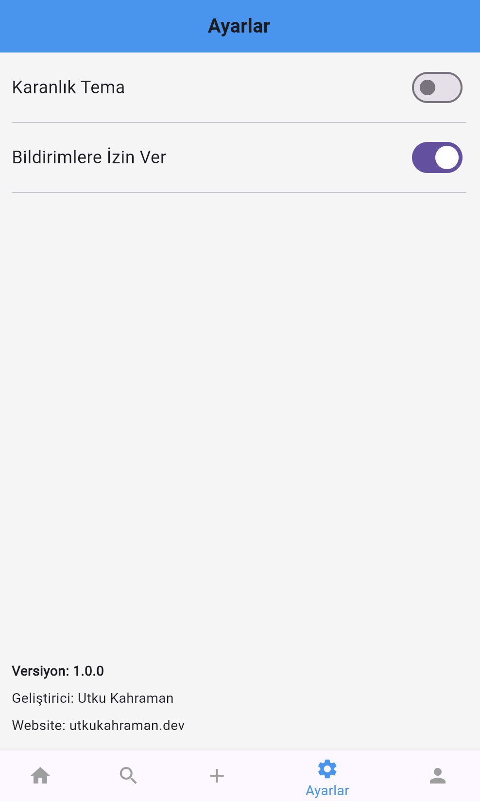
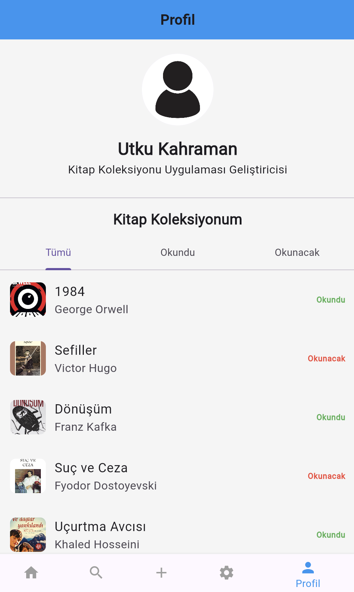

# Book Collection


## Proje Hakkında

**Book Collection** uygulaması, kullanıcıların kitap koleksiyonlarını dijital ortamda düzenlemelerine ve takip etmelerine olanak tanır. Kullanıcılar kitapları kategorilere ayırarak, okumak istedikleri, okudukları veya okudukları kitaplarla ilgili notlar alabilirler. Kitap ekleyebilir ve koleksiyonlarını başkalarına gösterebilirler.

## Ekibimiz
+ **Danışman:** Keyvan Arasteh [GitHub](https://github.com/keyvanarasteh)
+ **Takım Üyeleri:** Utku Kahraman [GitHub](https://github.com/utkukhraman)

## Özellikler
- Okunacak ve okunan kitapların listelenmesi
- Okunmuş ve okunacak kitaplar için ayrı bölümler
- Kitap arama ve filtreleme
- Gündüz ve gece modu

## Kullanılan Teknolojiler
- Flutter
- Dart

## Başlangıç

### Gereksinimler
- Flutter SDK (sürüm 10.0.19045.5131)
- Dart SDK

### Kurulum Adımları
1. Projeyi bilgisayarınıza indirin:
     ```bash
     git clone https://github.com/utkukhraman/Book-Collection
     ```
2. Proje klasörüne gidin:
     ```bash
     cd Book-Collection
     ```
3. Gerekli paketleri yükleyin:
     ```bash
     flutter pub get
     ```
4. Uygulamayı başlatın:
     ```bash
     flutter run
     ```

## Proje yapısı

## 📂 Proje Yapısı

- `assets/`
   - `images/` → Genel Görsellerin Tutulduğu Klasör
      - `books/` → Kitap Görsellerinin Tutulduğu Klasör
      - `screenshots/` → Proje Ekran Görüntülerinin Bulunduğu Klasör
   - `videos/` → Proje Videolarının Tutulduğu Klasör
- `lib/`
   - `add_book.dart` → Kitap Eklenen Sayfa
   - `book_info.dart` → Kitap Bilgi Sayfası
   - `main.dart` → Kitapların Listelendiği ve Menünün Olduğu Sayfa
   - `data.dart` → Kitap Datalarının Olduğu Sayfa
   - `profile.dart` → Profil, Okunan ve Okunacak Kitapların Listelendiği Sayfa
   - `search.dart` → Kitap Araması Yapılan Sayfa
   - `settings.dart` → Ayarların Yapıldığı Sayfa


## Ekran Görüntüleri













## Demo

### 🎨 Light Tema
[](https://youtube.com/shorts/qbuHwcFJMxQ)

### 🌙 Dark Tema
[](https://youtube.com/shorts/LVPeaeT7A3E)


## Projeye Katkı Sağlama

1. Projeyi forklayın
2. Yeni bir dal oluşturun (`git checkout -b ozellik/YeniOzellik`)
3. Değişikliklerinizi kaydedin (`git commit -m 'Yeni özellik eklendi'`)
4. Dalınıza gönderin (`git push origin ozellik/YeniOzellik`)
5. Pull request oluşturun

## Lisans
[MIT Lisansı] kapsamında lisanslanmıştır. Daha fazla bilgi için `LICENSE` dosyasını inceleyebilirsiniz.

## İletişim
Utku Kahraman  
📧 Mail: [ben@utkukahraman.dev](mailto:ben@utkukahraman.dev)  
🌐 Web: [utkukahraman.dev](https://utkukahraman.dev)

## Teşekkürler
- İstinye Üniversitesi'ne destekleri için teşekkür ederiz.
